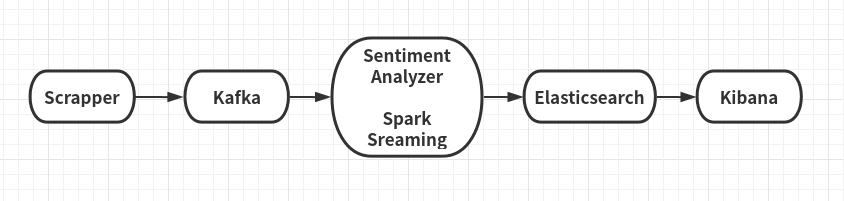

# Twitter-Sentiment-Analysis
Twitter Sentiment Analysis using Apache Spark Streaming

**Scrapper** 
Used a scrapper in python using Tweepy to scrape the tweets based on certain keywords

**Kafka** 
Used Kafka to store the tweets according to topics

**Spark Streaming** 
I created a Kafka consumer and periodically collect filtered tweets from scrapper. For each hash tag, performed sentiment analysis using Sentiment Analyzer

**Sentiment Analyzer** 
Used Vader Sentiment

**Elasticsearch** 
Store the tweets and their sentiment information for further visualization purpose

**Kibana** 
Used kibabana, a visualization tool to show the tweets' sentiment classification result in a real-time manner
